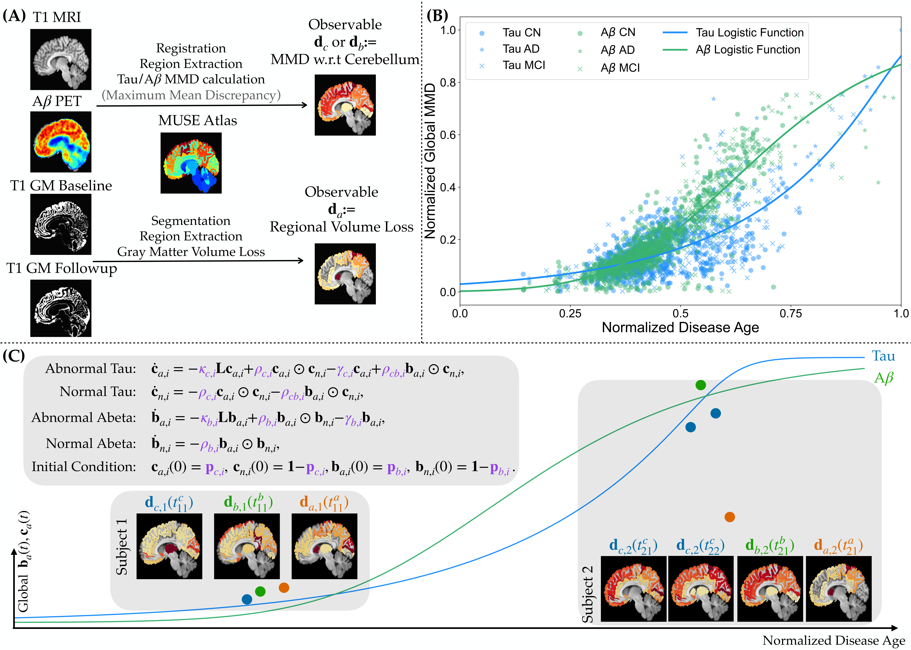

# MedIA code

This repository contains the implementation of the MedIA 2025 paper: https://doi.org/10.1016/j.media.2025.103757


---

## Citation
If you use the repo, please cite the following papers:

Wen, Zheyu, George Biros, and Alzheimer’s Disease Neuroimaging Initiative. "Aligning personalized biomarker trajectories onto a common time axis: a connectome-based ODE model for Tau–Amyloid beta dynamics." Medical Image Analysis (2025): 103757.


## Prerequisites

The code has been tested with the following environment:

- Python 3.10  
- numpy 1.26.4
- pandas 2.3.3  
- scikit-learn 1.7.2  
- scipy 1.15.2  
- nibabel 5.3.2

---

## File Structure

The repository is organized as follows:

- **Main entry points**
  - `main_synth.py`: Synthetic data generation and validation
  - `main_clinical.py`: Clinical PET scan reconstruction and prediction

- **data/**  
  Contains MUSE atlas related ROI information.

- **scripts/**  
  Utility scripts for disease-age construction and helper functions used in the inversion procedure.

- **src/**  
  Core model implementation, including:
  - Forward model operators
  - Adjoint equation solvers
  - Gradient computation utilities for model parameters

## Running the Code

All local commands below assume execution from the root `MedIA2025_code` directory.

### Task 1: PET reconstruction.

```bash
python -u main_clinical.py --pat_ids 0 --role fitting --use_multiscan 0
```

### Task 1: PET prediction

```bash
python -u main_clinical.py --pat_ids 0 --role extrap --use_multiscan 0
```

## Notes

- The parameter `pat_ids` controls which subject to invert.
- The parameter `role` controls which task to perform.
- The parameter `use_multiscan` controls if use multiple scans of the subject or just single scan.
- To run all the subjects, refer to the example job script in job_sh_scripts
## License

This code is released under the **Creative Commons Attribution–NonCommercial 4.0 International License (CC BY-NC 4.0)**.

The code may be used, modified, and redistributed for **non-commercial academic and research purposes only**, with appropriate attribution.
Commercial use requires explicit permission from the authors.
